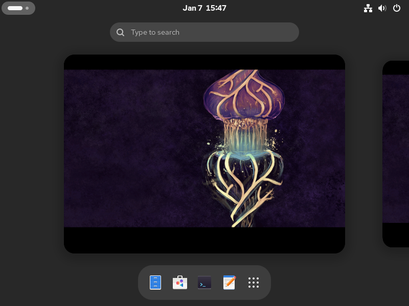

# Calcite



Calcite is a CentOS Stream bootc-based system with GNOME. It is designed as a usable desktop base image and can even just be rebranded with no other changes.

> [!IMPORTANT]
> The `9` branch is no longer maintained. If you have it installed, please reinstall your OS.

> [!WARNING]
> Setting up an internet connection is mandatory, otherwise installation will fail. If you can't set up an internet connection, do not install this software.

## Download

[Download the ISO](https://nightly.link/CalciteAuthors/calcite/workflows/iso/main/iso.zip), or use your favorite way to provision a device with bootc.

## FAQ

### Why is there no web browser?

Open the Software app and download your favorite web browser.

### What's the difference between this and HeliumOS?

Both can be used for the same purposes but we prefer to keep our tweaks minimal, and we do not change branding.

### How do you upgrade this?

Run this in a terminal emulator:

```bash
sudo bootc upgrade
```

Note that it is not supported by us to upgrade between major versions, like 9 ➛ 10.

## Known issues

- A small volume may be shown in Files. This is a loop device critical for the system and we can't hide it.
- Secure Boot may not work. This is caused by a pending [shim review](https://github.com/rhboot/shim-review/issues/454) upstream. Shortly after it is approved Secure Boot will start working.
